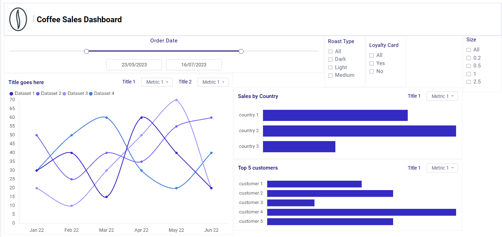
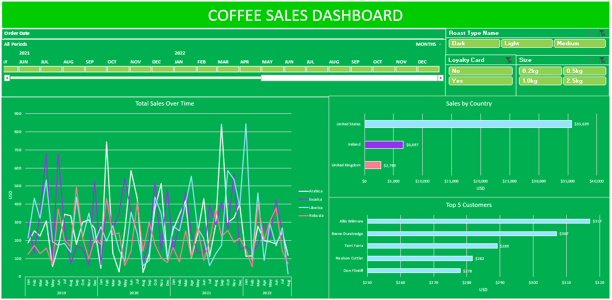
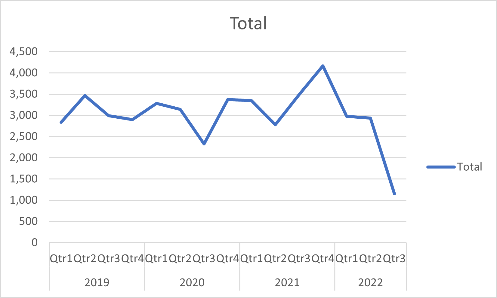
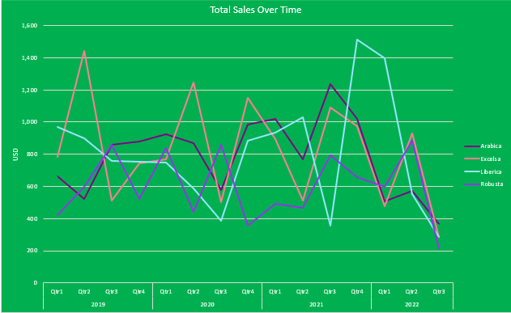
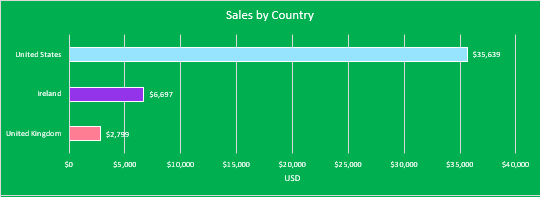
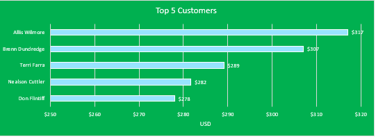

# Data Portfolio: Coffee Product Ananlysis (Excel)


# Table of Contents

- [Objective](#Objective)
  - [User Story](#User_Story)
- [Data Source](#Data_Source)
- [Stages](#Stages)
- [Design](#Design)
  - [Dashboard Mockup](#Dashboard_Mockup)
  - [Tools](#Tools)
- [Development](#Development)
  - [Pseudocode](#Pseudocode)
  - [Data Exploration](#Data_Exploration)
  - [Data Cleaning](#Data_Cleaning)
  - [Transform the data](#Transform_the_data)
- [Testing](#Testing)
  - [Data Quality Tests](#Data_Quality_Tests)
- [Visualisation](#Visualisation)
  - [Results](#Results)
- [Analysis](#Analysis)
  - [Findings](#Findings)
  - [Validation](#Validation)
- [Conclusion](#Conclusion)
  - [Discovery](#Discovery)
  - [Recommendations](#Recommendations)
  - [Potential ROI](#Potential_ROI)
  - [Course of Action](#Course_of_Action)


# Objective
- Key issue:

The marketing team wants to find what the best coffee products are to set up marketing campaigns.

- Proposed Solution:
  
A dashboard will be created to provide actionable insights into the top coffee products globally. The dashboard will include:
- Top customers
- Sales per region
- Product sales performance
- Relevant slicers
  
These metrics will assist the marketing team decide on which coffee products would be best for the proposed marketing campaigns.

## User Story
" As the lead of the marketing team, I need to visualise key metrics through an informative dashboard to analyse global coffee sales data.

This should allow our team to identify the top performing coffee products through sales metrics. The insights gathered will drive decisions about which product is best to focus on for our new marketing campaigns and maximise potential ROI"

# Data Source

- We product performance data on coffee sales that includes:
  - Product Information
  - Customer Information
  - Order Information
  - Where the data is coming from? (The data is sourced from an independant source)
  
# Stages

1. Design
2. Development
3. Testing
4. Analysis
   
# Design

## Dashboard Questions
- What should the dashboard contain based on the above requirements?
  
- What are the initial insight questions the dashboard needs to answer?
1. Which is the best selling roast type?
2. Do loyalty cards affect sales?
3. What seasons have the highest sales?
4. Which countries have the highest sales?
5. What size of coffee has the highest sales?
6. Which coffee product performs the best?

As we progress through the analysis, these questions may develop.

## Dashboard Mockup

Recommended data visuals:
1. Timeline
2. Horizontal Time History Graph
3. Slicers
4. Horizontal bar chart



## Tools

| Tool  | Purpose                                                   |
| --------- | ----------------------------------------------------- |
| Excel     | Exploring the data                                    |
| GitHub    | Hosting the project documentation and version control |
| Mokkup AI | Designing the wireframe of the dashboard              |


# Development
## Pseudocode

- What is the general approach to solving the issue from end to end?

1. Gather the data
2. Explore the data in Excel
3. Clean the data in Excel
4. Create Relevant Pivot Tables in Excel
5. Visualise the data in Excel
6. Generate the findings based on the insights
7. Write-up documentation and commentary
8. Publish the data to relevant stakeholders


## Data Exploration

The gathered data will be audited for quality looking mainly for errors, inconsistencies, bugs and unusual characters and/or layout of data etc.

- What are the findings from the data exploration?

1. All relevant data is present within the files gathered so no need to request more data.
2. Some customers did not provide contact details in the form of an email address.
3. Some Columns have abbreviated data within that could cause confusion.

## Data Cleaning

- What do we expect the clean data to contain and what constraints are required?

1. Relevant columns should be retained.
2. All data types should be appropriate for the contents of each column.
3. There should be no null values i.e. complete data for all records.

- What are the steps needed to clean and shape the data?

1. Combine tables together
2. Edit fields with abbreviations
3. Create sales measures

### Transform the Data

The following Excel formulas were used to combine tables together, edit abbreviations and create sales data:

**Looking up customer name**
```
=XLOOKUP(C2,customers!$A$1:$A$1001,customers!$B$1:$B$1001,,0)
```

**Looking up customer email address and control measure for blank data**
```
=IF(XLOOKUP(C2,customers!$A$1:$A$1001,customers!$C$1:$C$1001,,0)=0,"",XLOOKUP(C2,customers!$A$1:$A$1001,customers!$C$1:$C$1001,,0))
```

**Index matching for product details**
```
=INDEX(products!$A$1:$G$49,MATCH(orders!$D2,products!$A$1:$A$49,0),MATCH(orders!I$1,products!$A$1:$G$1,0))
```

**Editing Abbreviated data**
```
=IF(I2="Rob","Robusta",IF(I2="Exc","Excelsa",IF(I2="Ara","Arabica",IF(I2="Lib","Liberica",""))))
```

**Loyalty Card verification**
```
=XLOOKUP([@[Customer ID]],customers!$A$1:$A$1001,customers!$I$1:$I$1001,,0)
```

# Testing
## Data quality tests

- What are the data quality tests?
  
A basic check for row count is carried out between sheets in the workbook.

# Visualization

## Results

How does the dashboards look?




# Analysis
## Findings

In this section we will answer our design stage questions:
1. Which is the best selling roast type?
2. Do loyalty cards affect sales?
3. What seasons have the highest sales?
4. Which countries have the highest sales?
5. What size of coffee has the highest sales?
6. Which coffee product performs the best?

### 1. Which is the best selling roast type?

| Roast Type  | Sales (£) | Percentage of Total |
|-------------|-----------|---------------------|
| Light       | 17,354    | 38.45%              |
| Medium      | 14,600    | 32.35%              |
| Dark        | 13,179    | 29.20%              |


### 2. Do loyalty cards affect sales?

| Loyalty Card | Sales (£)|Percentage of Total |
|--------------|----------|--------------------|
| No           | 24,216   | 53.65%             |
| Yes          | 20,917   | 46.35%             |


### 3. What seasons have the highest sales?




### 4. Which countries have the highest sales?

| Country | Sales (£) |Percentage of Total |
|---------|-----------|--------------------|
| USA     | 35,638    | 78.96%             |
| Ireland | 6,696     | 14.84%             |
| UK      | 2,798     | 6.20%              |

### 5. What size of coffee has the highest sales?

| Rank | Coffee Size  | Sales  (£)  | Percentage of Total |
|------|--------------|------------ |---------------------|
| 1    | 2.5          | 23,785      | 52.70%              |
| 2    | 1.0          | 11,010      | 24.40%              |
| 3    | 0.5          | 7,029       | 15.58%              |
| 4    | 0.2          | 3,307       | 7.33%               |

### 6. Which coffee product performs the best?

| Rank | Coffee Product | Sales (£)  |Percentage of Total |
|------|----------------|----------- |--------------------|
| 1    | Excelsa        | 12,306     | 27.27%             |
| 2    | Liberica       | 12,054     | 26.71%             |
| 3    | Arabica        | 11,768     | 26.07%             |
| 4    | Robusta        | 9,005      | 19.95%             |

### Outcome

For the next steps we need to look at analysing the metrics that are key for generating the expected ROI for the client:

1. Roast Type Performance
2. Geographical Sales
3. Top Customers

## Validation

### 1. Roast Type Performance

#### Output



### 2. Geographical Sales

#### Output



### 3. Top Customers

#### Output




# Conclusion
## Discovery

What were the overall findings?

1. The largest coffee serving of 2.5 performed the best with over half of all sales. The next highest size accounted for less than 1/4 of overall sales.
2. The USA accounted for over 3/4 of the market and out performed the UK and Ireland considerably.
3. Sales from those without a loyalty card were 7.3% higher than those with a card.
4. Roast type sales didnt show any significant finding with a variation of ~ 4% between the three roasts.
5. There is a similar relationshit between the product type with a very balanced performance across the board.

## Recommendations

Actionable Insights:


1. The **2.5** size performs the best across all locations and should be targeted for promotions and deals.

2. The **USA** market should be the main forcus for marketing campaigns as it generates the **highest sales** currently.

3. Promotions and **increased advertising** in the **UK and Ireland** should be a priority to expand the market potential.

4. **Loyalty promotions** and deals should be a focus as **non-members** account for the majority of sales.

5. **Seasonal events** and promotions should be a large focus as there are currently **no trends** in seasonal sales over the last 3 years.
   


## Potential ROI
What ROI is expected based on the actionable insights?

1. Setting up a **Loyalty card offer** deal for new customers to push loyalty card applicants should increase sales. (Birthday free coffee, free coffee after x purchases etc.)
2.  **Seasonal products and offers** should be a main focus to enhance sales during key seasons (New Year, Easter, Summer holidays, Halloween, Black Friday and Christmas)
3. An **increase advertising push** for UK and Ireland markets should be a priority as the market share here is small.


## Course of Action

Based on the analysis, for continues profits, targeting the **2.5** size coffee in the **USA** with a **loyalty promotion** should see increased profits.
This initial deal will be assessed againsts the marketing teams initial forecasting. If the milestones are met throughout the deal, then future promotions can be implemented.


